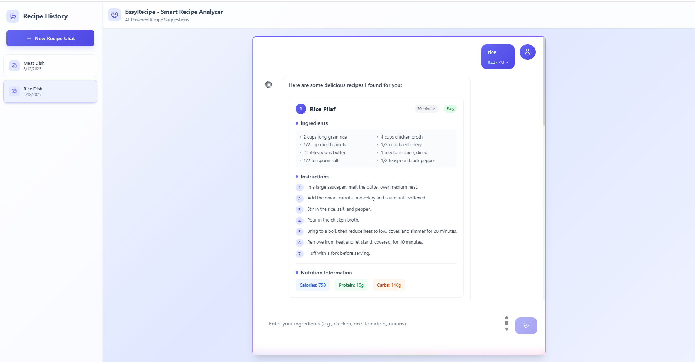

# 🍳 EasyRecipe - Smart Recipe Analyzer

> **AI-Powered Recipe Suggestions with Intelligent Ingredient Analysis**

## 📱 Project Overview



*EasyRecipe's intuitive chat interface showcasing AI-powered recipe generation with real-time streaming responses*

EasyRecipe is a modern web application that transforms your available ingredients into delicious recipe suggestions using advanced AI technology. Simply input what you have in your kitchen, and let our smart analyzer create personalized recipes with detailed instructions and nutritional information.

   

## ✨ Features

### 🤖 **AI-Powered Recipe Generation**
- **Smart Ingredient Analysis**: Advanced AI processes your available ingredients
- **Multiple Recipe Suggestions**: Get 2-3 unique recipe options per request
- **Nutritional Information**: Detailed calories, protein, and carb breakdown
- **Difficulty Levels**: Recipes categorized as Easy, Medium, or Hard
- **Cooking Time Estimates**: Accurate preparation and cooking time predictions

### 💬 **Interactive Chat Interface**
- **Real-time Streaming**: Server-Sent Events (SSE) for live response streaming
- **Session Management**: Create, rename, and delete recipe chat sessions
- **Chat History**: Persistent conversation storage with session persistence
- **Responsive Design**: Optimized for desktop and mobile devices

### 🎨 **Modern UI/UX**
- **Glassmorphism Design**: Beautiful backdrop blur effects and transparency
- **Blue Gradient Theme**: Elegant color scheme with smooth transitions
- **Custom Animations**: 12+ custom animations including fade-in, bounce, and shimmer effects
- **HeroIcons Integration**: Modern iconography throughout the interface
- **Custom Scrollbars**: Styled scrollbars with gradient effects

### 🔧 **Technical Features**
- **FastAPI Backend**: High-performance Python backend with async support
- **React 19**: Latest React with modern hooks and components
- **TailwindCSS v4**: Advanced styling with custom design system
- **Supabase Integration**: PostgreSQL database for session persistence
- **Rate Limiting**: Built-in API rate limiting for stability
- **Error Handling**: Comprehensive error handling and user feedback

## 🏗️ Tech Stack

### Frontend
- **React 19.1.1** - Modern UI library with latest features
- **Vite** - Fast build tool and development server
- **TailwindCSS 3.4.0** - Utility-first CSS framework
- **Axios** - HTTP client for API communication
- **HeroIcons** - Beautiful SVG icons

### Backend
- **FastAPI 0.68.0** - Modern Python web framework
- **Uvicorn** - ASGI server for FastAPI
- **Pydantic** - Data validation and serialization
- **Supabase** - PostgreSQL database service
- **HuggingFace Hub** - AI model integration
- **SlowAPI** - Rate limiting middleware

### AI Integration
- **Mistral 7B Instruct v0.3** - Advanced language model via HuggingFace API
- **Server-Sent Events** - Real-time streaming responses
- **Custom Prompt Engineering** - Optimized prompts for recipe generation

## 🚀 Quick Start

### Prerequisites

Ensure you have the following installed:
- **Node.js** (v18 or higher)
- **Python** (v3.8 or higher)
- **Git**

### Installation

1. **Clone the repository**
```bash
git clone https://github.com/yourusername/easyrecipe.git
cd easyrecipe
```

2. **Set up environment variables**
```bash
# Copy the environment template
cp .env.example .env

# Edit .env file with your API keys
# Required: HUGGINGFACE_API_KEY, SUPABASE_URL, SUPABASE_KEY
```

3. **Backend Setup**
```bash
# Navigate to backend directory
cd backend

# Create virtual environment
python -m venv venv

# Activate virtual environment (Windows)
venv\Scripts\activate
# Activate virtual environment (macOS/Linux)
source venv/bin/activate

# Install dependencies
pip install -r requirements.txt

# Run database setup
python -c "from database import create_tables; create_tables()"
```

4. **Frontend Setup**
```bash
# Navigate to frontend directory (from project root)
cd frontend

# Install dependencies
npm install

# Install additional TailwindCSS dependencies
npm install @tailwindcss/postcss
```

### Running the Application

1. **Start the Backend Server**
```bash
# From backend directory
cd backend

# Activate virtual environment if not already active
venv\Scripts\activate  # Windows
source venv/bin/activate  # macOS/Linux

# Start FastAPI server
python main.py

# Server will run on http://localhost:8000
```

2. **Start the Frontend Development Server**
```bash
# From frontend directory (new terminal)
cd frontend

# Start Vite development server
npm run dev

# Application will be available at http://localhost:5173
```

3. **Access the Application**
   - Open your browser and navigate to `http://localhost:5173`
   - Start creating recipe chats and analyzing ingredients!

## 📁 Project Structure

```
easyrecipe/
├── backend/                 # Python FastAPI backend
│   ├── main.py             # FastAPI application entry point
│   ├── ai_service.py       # AI integration and prompt engineering
│   ├── database.py         # Database operations and models
│   ├── models.py           # Pydantic data models
│   └── requirements.txt    # Python dependencies
├── frontend/               # React frontend application
│   ├── src/
│   │   ├── components/     # React components
│   │   │   ├── Chat/       # Chat-related components
│   │   │   └── UI/         # Reusable UI components
│   │   ├── App.jsx         # Main application component
│   │   ├── index.css       # Global styles and Tailwind config
│   │   └── main.jsx        # React application entry point
│   ├── package.json        # Node.js dependencies
│   ├── tailwind.config.js  # TailwindCSS configuration
│   └── vite.config.js      # Vite build configuration
├── .env                    # Environment variables
├── .gitignore             # Git ignore rules
└── README.md              # Project documentation
```

## 🔧 Configuration

### Environment Variables

Create a `.env` file in the project root with the following variables:

```env
# AI Service Configuration
HUGGINGFACE_API_KEY=your_huggingface_api_key_here

# Database Configuration
SUPABASE_URL=your_supabase_project_url
SUPABASE_KEY=your_supabase_anon_key

# API Configuration
API_BASE_URL=http://localhost:8000
FRONTEND_URL=http://localhost:5173

# Rate Limiting
RATE_LIMIT_REQUESTS=100
RATE_LIMIT_WINDOW=3600
```

### Database Setup

The application uses Supabase (PostgreSQL) for data persistence:

```bash
# Run database migrations
cd backend
python -c "from database import create_tables; create_tables()"
```

## 🎯 Usage Examples

### Basic Recipe Generation
1. Open the application at `http://localhost:5173`
2. Click "New Recipe Chat" to start a session
3. Enter your available ingredients (e.g., "chicken, rice, tomatoes, onions")
4. Press Enter or click the send button
5. Watch as AI generates personalized recipes in real-time!

### Advanced Features
- **Session Management**: Rename sessions by clicking the edit icon
- **Recipe History**: Access previous conversations from the sidebar
- **Nutritional Info**: View detailed nutritional breakdown for each recipe
- **Multiple Options**: Get 2-3 different recipe suggestions per request

## 🛠️ Development

### Available Scripts

**Frontend:**
```bash
npm run dev      # Start development server
npm run build    # Build for production
npm run preview  # Preview production build
npm run lint     # Run ESLint
```

**Backend:**
```bash
python main.py           # Start FastAPI server
python -m pytest        # Run tests (if available)
python -m uvicorn main:app --reload  # Start with auto-reload
```

### Code Style
- **Frontend**: ESLint configuration with React hooks rules
- **Backend**: Follow PEP 8 Python style guidelines
- **CSS**: TailwindCSS utility classes with custom design system

## 🤝 Contributing

1. Fork the repository
2. Create a feature branch (`git checkout -b feature/amazing-feature`)
3. Commit your changes (`git commit -m 'Add amazing feature'`)
4. Push to the branch (`git push origin feature/amazing-feature`)
5. Open a Pull Request

## 📝 License

This project is licensed under the MIT License - see the [LICENSE](LICENSE) file for details.

## 🙏 Acknowledgments

- **HuggingFace** for providing access to Mistral 7B model
- **Supabase** for database infrastructure
- **TailwindCSS** for the amazing utility-first CSS framework
- **React Team** for the incredible UI library
- **FastAPI** for the high-performance Python framework

## 📞 Support

If you encounter any issues or have questions:

1. Check the [Issues](https://github.com/yourusername/easyrecipe/issues) page
2. Create a new issue with detailed information
3. Contact the development team

---

**Made with ❤️ by the EasyRecipe Team**

*Transform your ingredients into culinary masterpieces with AI-powered recipe generation!*